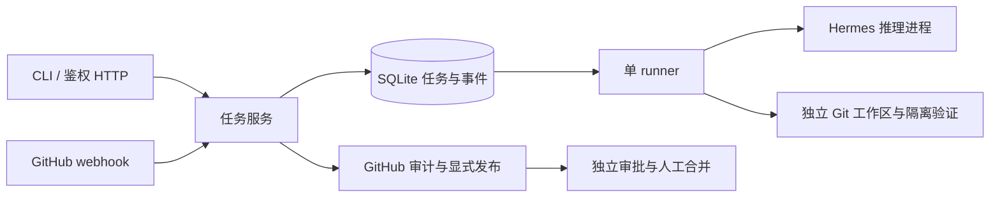

# 架构文档

这里记录 Mikasa、Hermes、外部集成、执行 worker 和持久化组件的职责边界与数据流。

当前结构为 CLI/HTTP → Service → SQLite、GitHub、独立工作区和 Hermes 进程。设计取舍见 [运行时决定](../decisions/0001-runtime.md)，入口见 [API 契约](API.md)。FluxCore 仅用于本体完成后的运行验收，见 [功能规划](../../MIKASA_FUNCTION_PLAN.md)。

聊天由 Mikasa 负责账号、持久化会话和命令事务，Hermes 负责官方共享命令组件与携带原生对话历史的 agent 执行，CCH 负责上游路由。通用执行能力优先复用 Hermes，业务授权与交付事实保留在 Mikasa；不并行维护 Hermes Gateway 会话库。具体接口与 `/new` 生命周期见 [命令与会话决定](../decisions/0003-hermes-commands-sessions.md)。

