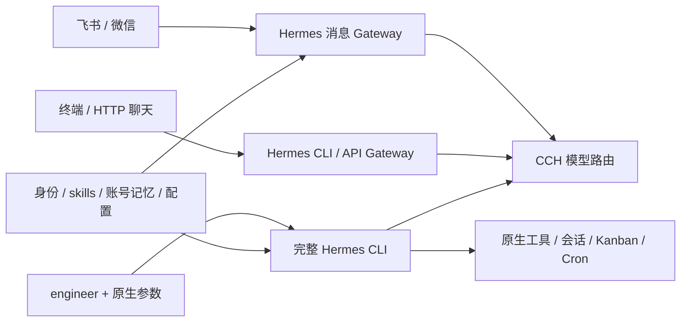

# 当前架构

固定 Hermes 0.21.3：`f9524d3f119c672e4a4444f56d582e7475716ba3`，不修改上游源码。

## 工程

`engineer --cwd 仓库 -- chat` 将控制权交给官方 `hermes_cli.main.main()`。原生参数原样透传，支持 chat、tools、skills、kanban、cron、gateway 等；使用实际工作目录和完整 Git 仓库。Hermes 决定工具发现、文件与终端操作、后台进程、委派、插件、MCP、会话压缩、worktree、预算和调度。Mikasa 工程插件只注入身份与协作约定、记录加载证据，不注册工具拦截器。

工程 profile 默认使用原生 local terminal，可在原生配置中改为其他 backend。没有 Mikasa 工具/skills 白名单、文本快照、24 次迭代或 128 事件限制、强制 JSON 交付、宿主检查/提交/发布、串行 runner。工程启动器只在准备 profile 时短暂加锁；会话和调度并发由 Hermes 管理。

这提供与相同配置的原生 Hermes 相同的能力入口，不保证未安装的外部工具自动可用。Git、gh、运行语言、浏览器、容器、MCP 和远端服务仍需实际依赖与权限。GitHub token 以 GH_TOKEN 提供给 Hermes 主进程及其原生凭据解析，不落盘；原生终端会清除该变量，gh 的独立登录仍需按原生认证流程准备；其他工具凭据通过 `engineering.env_allowlist` 显式注入或工程 profile 的原生配置提供。

工程目标、推送、发布和审查安排由用户授权、skills 与记忆指导，不再由宿主角色/任务类型硬门槛执行。Mikasa 不自动合并。

## 聊天

一个 `gateway --platform feishu --platform weixin` 管理两个消息平台。飞书开放群聊、无需 @，保留原生回环保护；微信使用已绑定主人私聊。发言人依据 Hermes 发送者元数据识别，不能用 profile 归属替代。

不同会话原生并发，同会话 FIFO；普通群及话题共享上下文，私聊按平台隔离。聊天暂开放 memory、skills、session_search，仓库执行入口最后接入。同一聊天 profile 的 CLI、HTTP Gateway 与消息 Gateway 互斥。工程有独立 profile，可与消息服务同时使用。

原生系统命令直接交给 Hermes。HTTP/单条消息模式保留鉴权、命令解析、取消和幂等回执，使用原生 Gateway 和 SSE 等待结果；流断开后读取同一 run 的持久状态，不重新发起推理。详见 [API](API.md)。

## 状态和身份

| runtime 下的路径 | 职责 |
| --- | --- |
| `native/<账号摘要>/` | 原生聊天会话、MEMORY/USER、配置和消息路由 |
| `engineer/<账号摘要>/` | 原生工程会话、配置、Kanban、Cron、默认持久 workspace |
| `engineer/<账号摘要>/memories` | 链接同账号聊天 memories，由 Hermes 负责锁和原子写入 |
| `mikasa.sqlite3` | HTTP 聊天鉴权关联、幂等回执、暂停设置及旧档案 |
| `engineering/`、`kanban/`、`scheduler/`、`workspaces/` | 旧任务档案，保留备份，不再执行 |

SOUL 来自 identity.md；人格 skill 常驻。工程契约与工作流生成 mikasa-engineering skill，工程入口自动加载，聊天按需加载。通用方法 skills 由原生发现和选择，没有指定任务白名单。长期记忆共享不等于当前实例即时刷新；会话历史分别保存在原生 SessionDB，可使用原生能力续接。

## 迁移与恢复

旧 worker v1 RPC、任务 CLI、runner 和工程 webhook 已退休；旧 HTTP /tasks 与 webhook 返回 410。既有任务、工作区和发布回执不自动重跑、不删除。需要历史执行环境时从 Git 中的迁移前版本独立恢复副本；不要将旧 runner 对准正在使用的新 runtime。

`backup`/ `restore` 复用 Hermes SQLite 快照，保留旧档案并纳入 engineer，支持 v2 备份读取与 v3 生成。只备份受管 runtime；外部 cwd、认证、自定义工具数据须独立管理。详见 [操作手册](../runbooks/OPERATIONS.md)。聊天工程任务和 FluxCore 仍是后续验收，当前事实见 [验证边界](../VALIDATION.md)。

Hermes 自身的确认与安全语义仍然保留：例如仓库 AGENTS.md 的文件工具修改默认要求交互确认，即使 --yolo 也不越过该原生保护。原生 security 配置可由用户维护，Mikasa 不追加第二套文件禁改规则。
