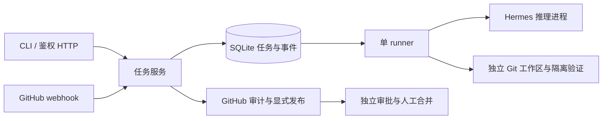

# 架构文档

这里记录 Mikasa、Hermes、外部集成、执行 worker 和持久化组件的职责边界与数据流。

当前结构为 CLI/HTTP → Service → SQLite、GitHub、独立工作区和 Hermes 进程。设计取舍见 [运行时决定](../decisions/0001-runtime.md)，入口见 [API 契约](API.md)。FluxCore 仅用于本体完成后的运行验收，见 [功能规划](../../MIKASA_FUNCTION_PLAN.md)。

