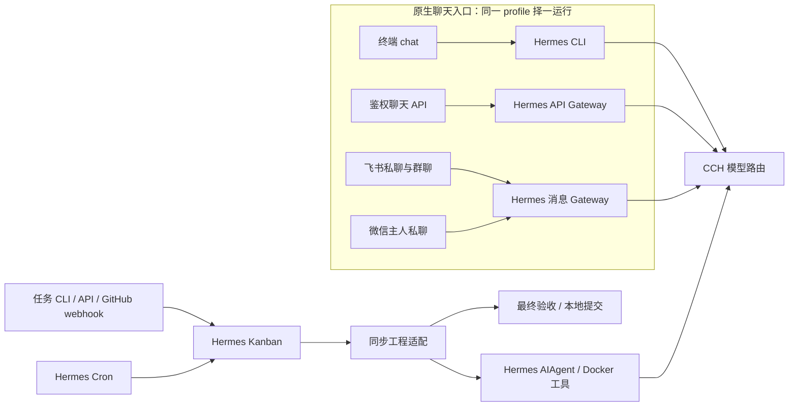

# 当前架构

固定 Hermes 0.21.3：`f9524d3f119c672e4a4444f56d582e7475716ba3`，不修改上游。Mikasa 是身份、工程 skills 和必要集成；CCH 是模型网关；模型执行与状态能力优先由 Hermes 承载。

## 执行路径

终端直接调用官方 `cli.main()`，完整系统命令与输入循环由 Hermes 提供。HTTP/`chat --message` 保留现有鉴权、命令和幂等回执契约，运行使用官方 Gateway。CLI 新会话不会自动登记为旧 API chat_id。同账号 CLI/Gateway 共用 profile 且进程互斥；本地 shell 是受信任负责人入口。

`mikasa gateway --platform feishu [--platform weixin]` 以前台方式启动一个固定 Hermes Gateway；显式平台配置可同时启用飞书插件和微信内置适配器，凭据仅经环境传入。飞书原生策略开放所有用户、群聊和机器人，不要求 @，保留 Hermes 自身回环和循环保护；微信仍限扫码负责人单聊。飞书负责人 ID 仅用于身份说明，不是准入白名单；profile 归属不等于消息发送者。Hermes 默认区分私聊与普通群内成员的会话，话题会话默认共享；所有会话共用 profile 级身份、skills 和 MEMORY/USER。保持与 CLI/API 相同的维护锁，默认无启动通知、输入状态或流式预览。`connections` 本地检查不初始化任务数据库，显式 `--probe` 只用于支持只读探针的平台；微信必须扫码后由真实 Gateway 验收。详见[接入手册](../runbooks/CONNECTIONS.md)。

原生 `/model` 支持 session/once/global，由配置别名选择模型、provider、协议和 Key。HTTP 暂仅支持 session，中文直接切换命令经额外推理验证后保存。模型选择不改变 CCH Key 分组、个人配置或工程默认值。聊天模型工具当前只有 memory 和只读 skills；原生系统命令是独立通道，不构成操作系统沙箱。

## 状态与记忆

以下路径均相对于配置中的 runtime：

| 路径 | 唯一事实源与用途 |
| --- | --- |
| `native/<actor 摘要>/` | 原生聊天 SessionDB、MEMORY/USER、偏好、运行回执与本机服务 Key |
| `engineering/<task-id>/` | 原生工程 SessionDB、账号/任务/仓库绑定及执行配置 |
| `kanban/kanban.db` | Hermes 任务、依赖、租约、run 与事件 |
| `scheduler/cron/` | Hermes 周期 job、到期状态与 execution 账本 |
| `workspaces/<task>/<attempt>/` | 独立 Git clone、检查与失败现场 |
| `mikasa.sqlite3` | 发布/聊天回执、控制设置及只读历史档案 |

工程 `memories` 链接提交账号的原生 memories，账号取自可信 task.actor。Hermes MemoryStore 负责并发锁与原子写入；不镜像记忆或数据库。长期安排由新实例加载，同一实例系统提示是冻结快照，不承诺外部修改热刷新；普通聊天正文不自动变为工程上下文。

工程根会话为 `mikasa-task-<task-id>`，用原生 compression tip 和 resume conversations 恢复完整工具历史。随机 run_id 用于本次容器与证据，不复用旧容器。中断后不自动重放未完成的工具副作用。旧任务实体 memories 留档为 memories.legacy，旧随机会话不自动合并；绑定冲突保留现场并报错。

身份以 SOUL 加载，工程规则通过 plugin 或工程 system 注入，persona 与任务 skills 来自受信任 manifest。实际请求指纹证明加载链路，不能保证模型必然遵循。审查分工由规则与记忆指导，Mikasa 不维护审批归属引擎、不自动合并。

## 任务与调度

`Kanban` 独立 SDK 进程调用官方任务、依赖和 dispatcher API。公开 spawn_fn 将唯一 claim 交给同步工程执行；当前宿主 runner 单任务运行并每秒唤醒。机器人映射原生 default 执行入口，人类任务不自动接管。`completion_contract=local-only`、`review_dispatch=false`，不引入 PR acceptance 门禁。

旧 API 状态是原生状态的兼容视图：ready/todo → queued，review → awaiting_review；blocked/triage/scheduled 根据原生事件区分阻塞、失败和取消。取消不使用会解除依赖的 archived；retry 重新检查原生父任务条件。claim TTL 120 秒，每 30 秒 heartbeat；结束与进度均核验租约。runner 中断后停放遗留任务，保留证据，等待显式重试。

Kanban 是唯一任务事实源；`mikasa_ids` 只存旧 ID、幂等键及原请求校验。首次迁移保留 ID、结果与事件，旧 tasks 变为只读 legacy_tasks；两库以 board_id 配对，缺失或错配拒绝空队列启动。迁移中断通过摘要检查继续，旧进程改写源数据则停止。不混跑新旧版本，不仅恢复单个数据库。

周期审计调用原生 Cron tick 和 no_agent 脚本；occurrence 幂等写入同一 Kanban，活跃审计不重复入板。首次启用等待一个间隔，重启保留下次时间；0 关闭，宿主暂停保留到期状态。只生成任务，不对外投递。长工程任务会延迟 tick；此专用 home 不额外运行第二个 ticker/dispatcher。

## 工程与兼容边界

Hermes 的原生 read/search/write/patch/terminal 在 Docker 快照内执行推理、检查和修复。Mikasa 保留快照导出、固定 revision 读取证据、合法差异导入、最终独立检查和本地提交。只读任务挂载 ro；模型认证、真实 .git 与账号记忆不挂到工具工作区。具体资源和文件边界见 [执行器](../../workers/hermes/README.md)。

一次 claim 只调用一次 worker。原生工具内修复后宿主独立验收一次，失败为 blocked，保留现场；显式 retry 使用新工作区，恢复原生历史并传入上次验收证据。没有宿主外层修复循环。第三方 worker v1 RPC 仍是已公开的兼容协议，内置 Hermes 不使用旧文件工具。

旧 HTTP 聊天正常等待消费原生 `/v1/runs/{id}/events`，结束后读取持久结果。固定 SDK 的 SSE 队列为单消费者、断线不能重放；EOF/404 后低频查询同一 run，401/403 直接报错，不重发推理或重订阅。暂停/超时调用原生 stop 并回收线程；对外仍返回最终 JSON，无自研 SSE 日志或网页。

GitHub REST/webhook 适配、显式发布与歧义回执暂留；平台权限与报告版本校验有效，不按作者或 CI 重写 Agent 结论。HTTP、worker 和快照适配的退出条件见 [计划](../../MIKASA_FUNCTION_PLAN.md)。

## 恢复与升级

`backup`/`restore` 覆盖上述受管状态，复用固定 Hermes `copy_db_and_verify`，补充多 home、Git 现场、内部链接和文件清单。原生整包备份会纳入认证并跳过 Git，不能直接用于此布局。helper 在上游标为插件兼容接口，升级 Hermes 前需复验，不假定永续稳定。

停服后维护锁阻止并发快照；恢复到新目录、校验 SHA-256、重定位运行字段并保留历史文本。保留本机 API Key 才能读取旧回执；外部认证独立提供。内容与限制见 [备份手册](../runbooks/OPERATIONS.md)。

固定版本的 `/new` 对自定义 CCH provider 无法可靠恢复配置默认值，当前保留已选模型；同进程 `--global` 不刷新启动时配置快照。显式 `/model ID` 可切换，保存的默认值重启后生效。升级时复验命令、plugin、SessionDB、memory、Kanban、Cron、SSE 与备份；当前 [验证记录](../VALIDATION.md) 不证明未执行的真实平台接入。
