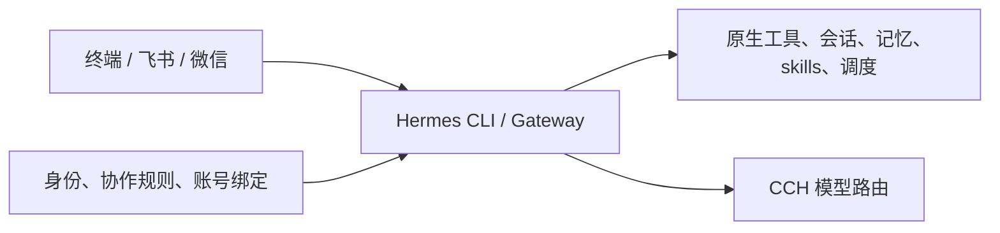

# 架构

Mikasa 的设计很简单：人格属于 Mikasa，执行属于 Hermes，模型路由属于 CCH。

## 三层边界

Hermes 是唯一的 Agent harness。它负责工具发现、文件和终端操作、后台进程、委派、MCP、会话压缩、worktree、Kanban、Cron、记忆和消息投递。Mikasa 不复制工具循环、transcript、任务账本或审批引擎。

CCH 只负责模型供应和路由。Hermes 原生处理 Responses、Messages 等协议；`/model` 由 Hermes 执行，Mikasa 只把已配置的模型来源生成原生 provider 和别名，不替 CCH 猜模型，也不偷偷做回退。

Mikasa 维护身份、人格 skill、工程协作规则、账号关系和平台启动适配。它在启动时生成 Hermes profile，保留 Hermes 自己写入的模型、显示偏好、记忆和会话；启动锁只保护初始化，运行期并发交给 Hermes 的 session lease 与 Gateway runtime lock。

## 交互

一个 Gateway 可以接入多个已配置平台。飞书群聊是否需要 @、微信主人绑定等属于平台接入配置；消息进入后，Hermes 负责发送者识别、会话划分、队列、工具进度、长任务提醒和最终回复。终端 CLI 可以与一个 Gateway 并存，两个 Gateway 不能同时占用同一 profile。

同一 profile 共享长期记忆和历史检索能力，但每个聊天仍按平台、聊天和话题划分上下文。`/new` 只新建会话，不删除记忆；`/resume` 和 `session_search` 由 Hermes 原生实现。独立工程 profile 与聊天 profile 分开保存会话，需要时链接同账号记忆。

## 工程环境

`engineer --cwd /path/to/repo -- chat` 直接进入 Hermes 原生工程入口。仓库中的规则文件、系统账号、Git、语言运行时、容器、MCP 和远端服务权限决定实际能力；Mikasa 不建立第二套文件黑名单或硬编码业务审批。

身份正文来自 [identity.md](../../identity.md)，工程规则来自 [engineering-contract.md](../../engineering-contract.md) 和 [engineering-workflow.md](../../engineering-workflow.md)。配置入口见[配置说明](../../config/README.md)，聊天和模型行为见[聊天手册](../runbooks/CHAT.md)与[CCH 手册](../runbooks/CCH.md)。

固定 Hermes 版本、依赖安装和平台适配位于 [`workers/hermes/`](../../workers/hermes/)。VM 部署代码属于开发和运维实现，不能替代目标机器上的权限、凭据和外部服务配置。
