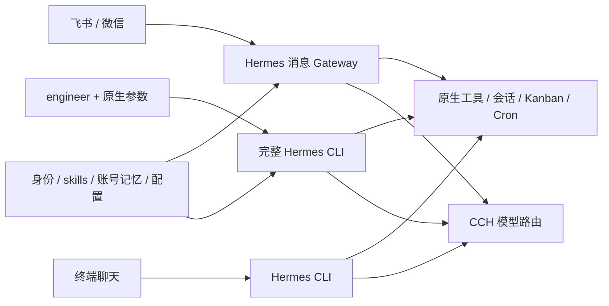

# 当前架构

固定 Hermes 0.21.3：`f9524d3f119c672e4a4444f56d582e7475716ba3`，不修改上游源码。

## 工程

`engineer --cwd 仓库 -- chat` 将控制权交给官方 `hermes_cli.main.main()`。原生参数原样透传，支持 chat、tools、skills、kanban、cron、gateway 等；使用实际工作目录和完整 Git 仓库。Hermes 决定工具发现、文件与终端操作、后台进程、委派、插件、MCP、会话压缩、worktree、预算和调度。Mikasa 工程插件只注入身份与协作约定、记录加载证据，不注册工具拦截器。

工程 profile 默认使用原生 local terminal，可在原生配置中改为其他 backend。没有 Mikasa 工具/skills 白名单、文本快照、24 次迭代或 128 事件限制、强制 JSON 交付、宿主检查/提交/发布、串行 runner。工程启动器只在准备 profile 时短暂加锁；会话和调度并发由 Hermes 管理。

这提供与相同配置的原生 Hermes 相同的能力入口，不保证未安装的外部工具自动可用。Git、gh、运行语言、浏览器、容器、MCP 和远端服务仍需实际依赖与权限。GitHub token 以 GH_TOKEN 提供给 Hermes 主进程及其原生凭据解析，不落盘；原生终端会清除该变量，gh 的独立登录仍需按原生认证流程准备；其他工具凭据通过 `engineering.env_allowlist` 显式注入或工程 profile 的原生配置提供。

工程目标、推送、发布和审查安排由用户授权、skills 与记忆指导，不再由宿主角色/任务类型硬门槛执行。Mikasa 不自动合并。

部署使用 Mikasa 自己的隔离工作机。普通用户具有完整 sudo，可自主安装依赖、运行容器和管理系统服务；服务进程不再套只写状态目录的沙箱。宿主文件、命令、SSH Agent 和其他机器网络在 OrbStack 配置层关闭。专用机原生普通命令审批设为 off，规则文件保护保留；运行权限及 OrbStack 共享内核的边界见 [工作机手册](../../deploy/vm/README.md)。

## 聊天

一个 `gateway --platform feishu --platform weixin` 管理两个消息平台。飞书开放群聊、无需 @，保留原生回环保护；微信使用已绑定主人私聊。发言人依据 Hermes 发送者元数据识别，不能用 profile 归属替代。

不同会话原生并发，同会话 FIFO；普通群及话题共享上下文，私聊按平台隔离。聊天直接使用原生平台完整工具集，在同一工作机执行工程任务；没有工具白名单或 Mikasa 轮数预算。进度、阶段说明、长任务通知与最终回复由 Hermes 回传原会话，不另建任务转发或通知服务。同一聊天 profile 的 CLI 与消息 Gateway 互斥；独立工程 CLI 的 profile 可与消息服务同时使用，历史分别保存。

上述互斥来自 Mikasa 启动器持有的整个进程生命周期锁，并非 Hermes 要求 CLI 与 Gateway 一律互斥。聊天入口只提供会话恢复参数和固定初始 workspace；完整原生 CLI 参数由独立 `engineer` 入口透传。工程与聊天的 profile 分离、仅链接长期记忆，也是本项目的布局选择。

消息快捷入口接受飞书和微信，直接使用 Hermes 的 `load_gateway_config()` 处理原生 YAML、嵌套配置、环境变量和平台偏好，再绑定本次选中的平台账号。`quick_commands`、`profile_routes`、渠道覆盖、语音和多 profile 设置交由原生配置管理，不再用字段白名单或强制关闭覆盖。飞书开放参与、微信主人绑定继续作为接入配置；其他平台可通过完整工程 CLI 的原生 Gateway 配置使用，需自行准备对应账号与依赖。

各入口继承真实系统账号的 HOME、PATH 和显式工具环境变量，使用同一 gh 认证与系统依赖。原生 config.yaml、.env、插件和 MCP 由 Hermes 管理；初始化只清除旧聊天适配写入的工具子集和默认预算一次，保留用户后续偏好。飞书开放成员可调用工程工具，权限按现有整机和平台配置执行，没有新增负责人专用工具门禁。

原生系统命令直接交给 Hermes。旧 `serve`、`chat --message`、HTTP 聊天和任务端点已删除；模型诊断也使用临时原生 CLI，不再启动本地 API 服务。

## 状态和身份

| runtime 下的路径 | 职责 |
| --- | --- |
| `native/<账号摘要>/` | 原生聊天会话、MEMORY/USER、配置和消息路由 |
| `engineer/<账号摘要>/` | 原生工程会话、配置、Kanban、Cron、默认持久 workspace |
| `engineer/<账号摘要>/memories` | 链接同账号聊天 memories，由 Hermes 负责锁和原子写入 |
| `mikasa.sqlite3` | 旧状态档案，仅备份保留，不再创建或写入 |
| `engineering/`、`kanban/`、`scheduler/`、`workspaces/` | 旧任务档案，保留备份，不再执行 |

SOUL 来自 identity.md；人格 skill 常驻。工程契约与工作流生成 mikasa-engineering skill，工程入口自动加载，聊天按需加载。通用方法 skills 由原生发现和选择，没有指定任务白名单。长期记忆共享不等于当前实例即时刷新；会话历史分别保存在原生 SessionDB，同 profile 使用 session_search、/resume 或 --resume 续接；独立工程与聊天历史不会自动合并。

## 迁移与恢复

旧 worker v1 RPC、任务 CLI、runner、HTTP 聊天和工程 webhook 已删除。既有任务、工作区和发布回执不自动重跑、不删除。需要历史执行环境时从 Git 中的迁移前版本独立恢复副本；不要将旧 runner 对准正在使用的新 runtime。

`backup`/ `restore` 复用 Hermes SQLite 快照，保留旧档案并纳入 engineer，支持 v2 备份读取与 v3 生成。VM 级维护入口另用 Restic 覆盖运行状态、`/home/mikasa/work`、服务配置和固定依赖，可在源码版本失败时回切旧目录。详见 [操作手册](../runbooks/OPERATIONS.md)。FluxCore PR #28 已完成首轮真实仓库交付验收。

Hermes 自身的确认与安全语义仍然保留：例如仓库 AGENTS.md 的文件工具修改默认要求交互确认，即使 --yolo 也不越过该原生保护。原生 security 配置可由用户维护，Mikasa 不追加第二套文件禁改规则。
