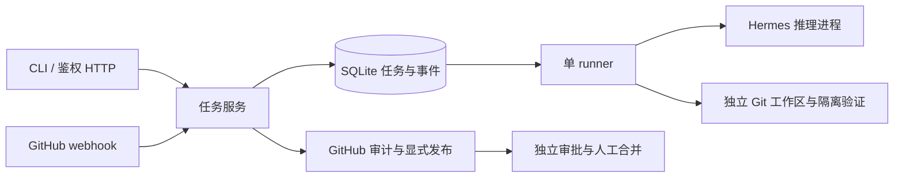

# 架构文档

这里记录 Mikasa、Hermes、外部集成、执行 worker 和持久化组件的职责边界与数据流。

当前结构为 CLI/HTTP → Service → SQLite、GitHub、独立工作区和 Hermes 进程。设计取舍见 [运行时决定](../decisions/0001-runtime.md)，入口见 [API 契约](API.md)。FluxCore 仅用于本体完成后的运行验收，见 [功能规划](../../MIKASA_FUNCTION_PLAN.md)。

聊天路径为 CLI/HTTP → Mikasa 账号授权与命令适配 → 每账号独立 Hermes Gateway → CCH。Hermes 保存原生 SessionDB、压缩历史、MEMORY/USER 记忆，执行 skills 和工具循环；Mikasa SQLite 保存任务、审批和对 native session/run 的引用，不重建模型上下文。旧 chat_turns 只作为迁移档案保留，不再写入。见 [原生运行决定](../decisions/0004-native-hermes-runtime.md)。

工程任务暂保留固定 head 读取、工作区授权及受控验证的 bridge。把它们接到原生文件/终端工具之前，必须验证容器隔离和凭据分离；本机 Docker daemon 未运行。真实 GitHub/飞书权限及 VM 由负责人稍后提供，聊天工程任务与试点最后执行。

