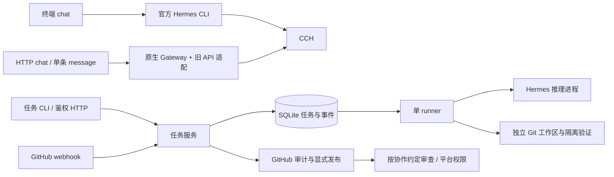

# 架构文档

目标为 Hermes 原生运行时 + CCH 模型配置 + Mikasa 身份、工程 skills 与协作记忆。审批分工通过规则和记忆指导，不另建 Mikasa 审批引擎。下文描述尚在迁移的实现，保留、迁移与删除清单见 [0006](../decisions/0006-hermes-native-mikasa.md)。

当前过渡实现结构为 CLI/HTTP → Service → SQLite、GitHub、独立工作区和 Hermes 进程。设计取舍见 [运行时决定](../decisions/0001-runtime.md)，入口见 [API 契约](API.md)。FluxCore 仅用于本体完成后的运行验收，见 [功能规划](../../MIKASA_FUNCTION_PLAN.md)。

终端聊天路径为 Mikasa profile 准备 → 官方 Hermes CLI → CCH，输入循环和完整命令分派已由 Hermes 接管。HTTP/单条 `--message` 暂留账号授权与命令适配 → 每账号 Hermes Gateway → CCH。两个入口使用同账号的 SessionDB 和 MEMORY/USER，但进程互斥；不另造会话或记忆库。原生命令行为与 API 兼容范围见 [0007](../decisions/0007-native-cli.md)。

Hermes 保存原生 SessionDB、压缩历史、MEMORY/USER 记忆，执行 skills 和工具循环；Mikasa SQLite 暂存任务、发布回执和对 native session/run 的引用；旧审批表仅为档案，不重建模型上下文。工程 profile 直接链接提交账号的原生 memories 目录，采用 Hermes 自带的并发文件锁；持续会话按任务保存，恢复原生压缩链及工具历史。旧 chat_turns 只作为迁移档案保留，不再写入。见 [工程会话决定](../decisions/0008-engineering-state.md)。

工程路径为 Service → 结构化 bridge → 官方 AIAgent harness → 原生 Docker 文件/终端工具。Mikasa 导出受控快照、核对固定 head 完整读取证据、导入合法差异并独立检查与提交；Hermes 管理工具循环、任务记忆、SOUL 与 skills。见 [原生工程决定](../decisions/0005-native-engineering-tools.md)。真实 GitHub/飞书权限及 VM 稍后讨论，聊天工程任务与试点最后执行。

